<div align="center">

# 🚀 ResolveAI

### Hybrid Enterprise Support Automation Platform  
**Local AI Intelligence • Semantic Routing • LLM Fallback • Human Escalation**

<p align="center">
Automate repetitive support tickets using privacy-first local models, intelligent fallback systems, and enterprise-grade observability.
</p>

<p align="center">
  
  
  
  
  
  
  
</p>

</div>

---

# 📌 Executive Summary

ResolveAI is a production-style enterprise support automation platform designed to intelligently resolve customer tickets at scale.

Instead of sending every support request to human agents or blindly relying on expensive LLMs, ResolveAI uses a **hybrid multi-layer decision engine**:

✅ Deterministic Keyword Rules  
✅ TF-IDF Semantic Matching  
✅ Local Sentence Transformer Classification  
✅ Confidence Threshold Routing  
✅ LLM Fallback for Complex Cases  
✅ Human Escalation for Sensitive Issues  
✅ Full Audit Logs + Analytics

This enables organizations to reduce support costs, improve speed, and maintain operational trust.

---

# 🎯 Why ResolveAI Matters

Modern support teams struggle with:

- Repetitive high-volume tickets  
- Slow manual resolutions  
- High support payroll costs  
- Overdependence on generic chatbots  
- Poor escalation workflows  
- No observability into AI decisions  

ResolveAI solves this with **fast local AI + safe fallback intelligence + human control loops**.

---
# 🌐 Live Links

Frontend Demo : https://resolveai-platform.netlify.app/
Backend API   : https://resolveai-backend-bv4e.onrender.com
Swagger Docs  : https://resolveai-backend-bv4e.onrender.com/docs

---


## 📸 Product Screenshots

### 1️⃣ Landing Page
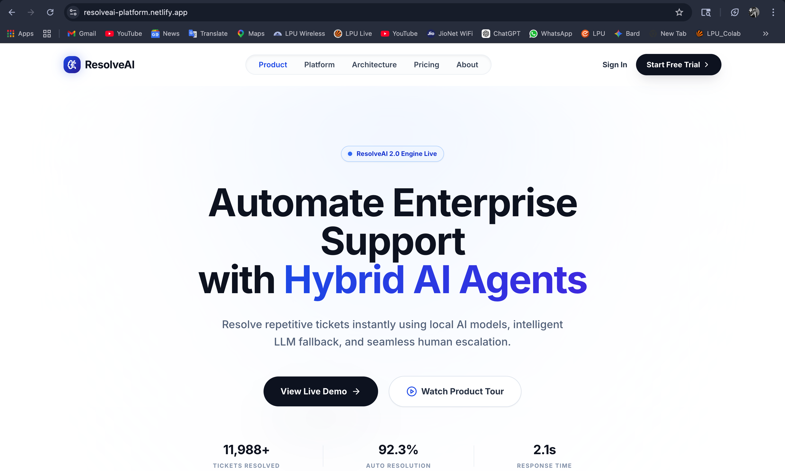

### 2️⃣ Platform Overview
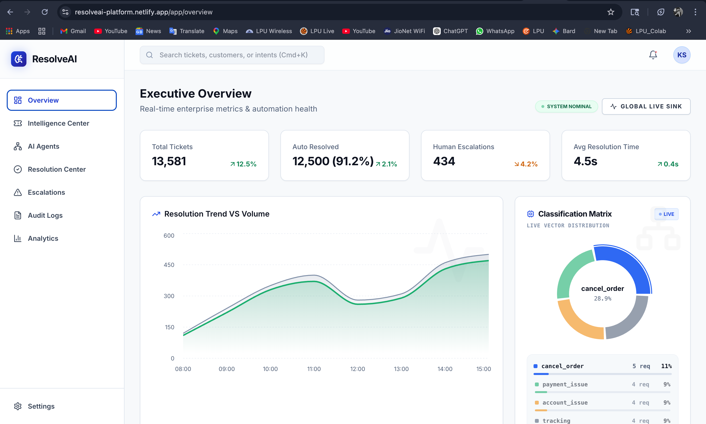

### 3️⃣ Live Ticket Dashboard
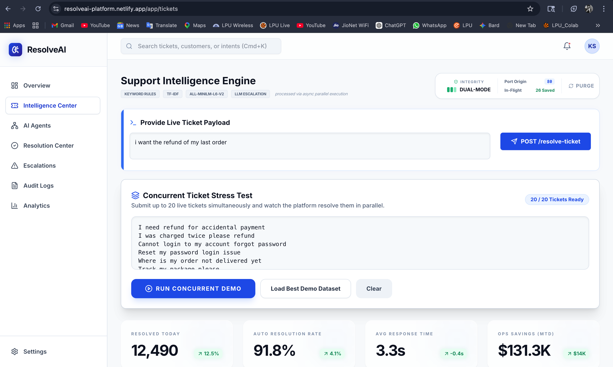

### 4️⃣ Concurrent Batch Processing
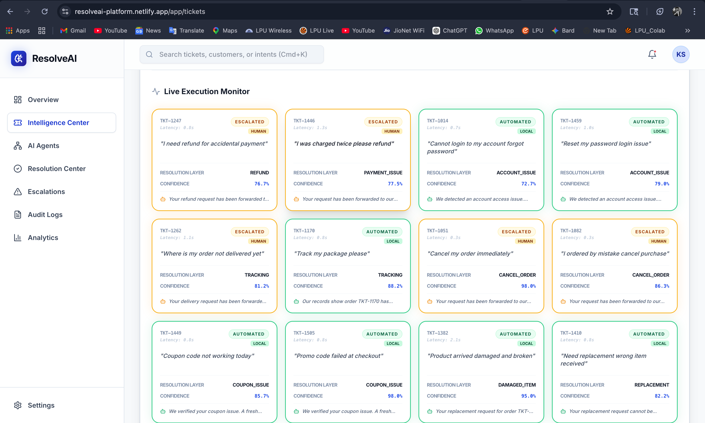

### 5️⃣ AI Agent Network
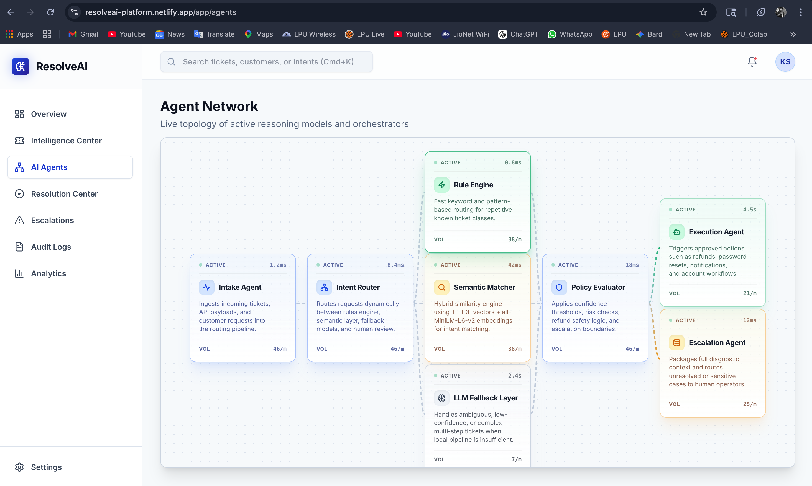

### 6️⃣ Resolution Center
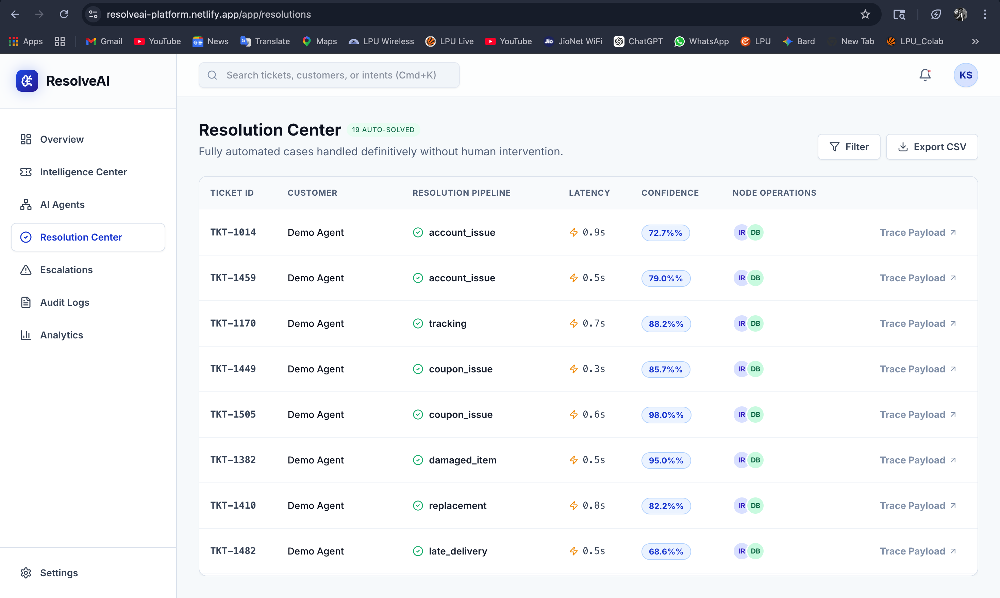

### 7️⃣ Human Escalation Review
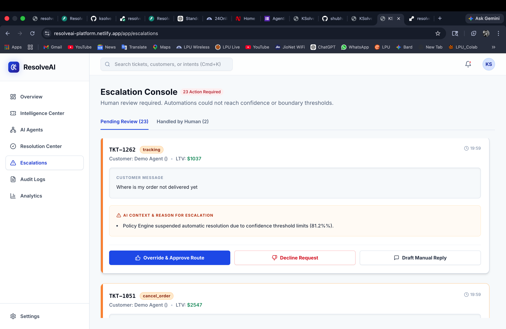

### 8️⃣ Unified Audit Logs
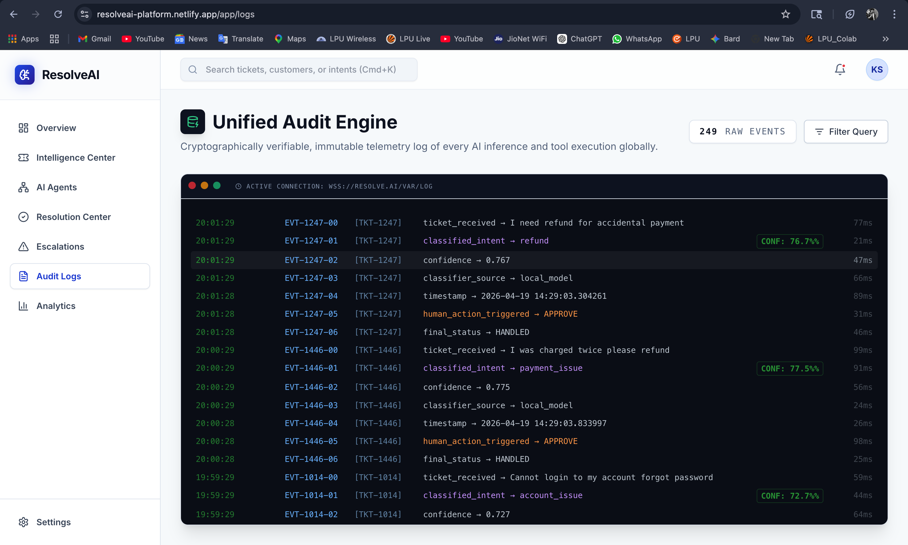

### 9️⃣ Analytics Dashboard
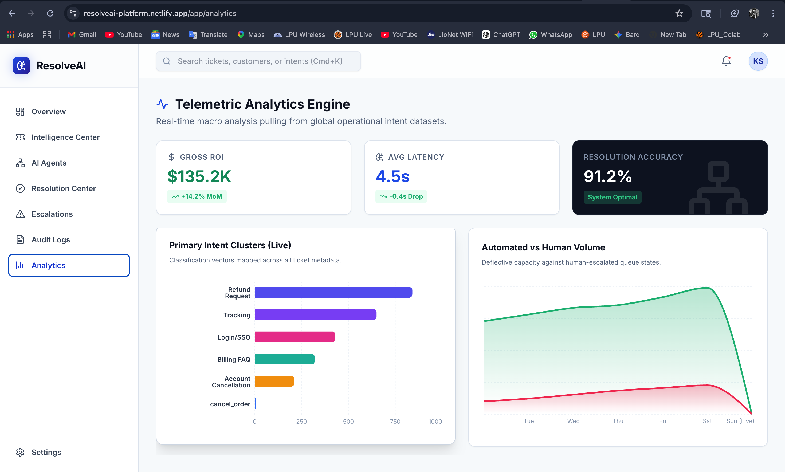

### 🔟 Diagnostic Trace Details
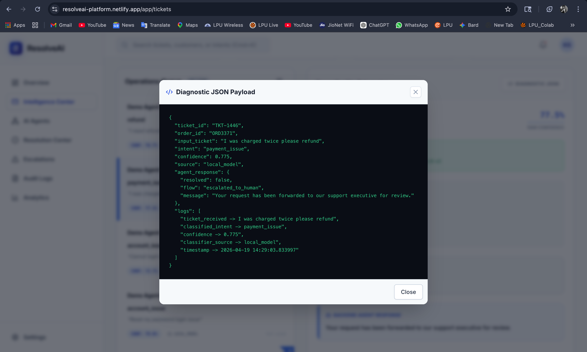

### 1️⃣1️⃣ Live Platform Experience
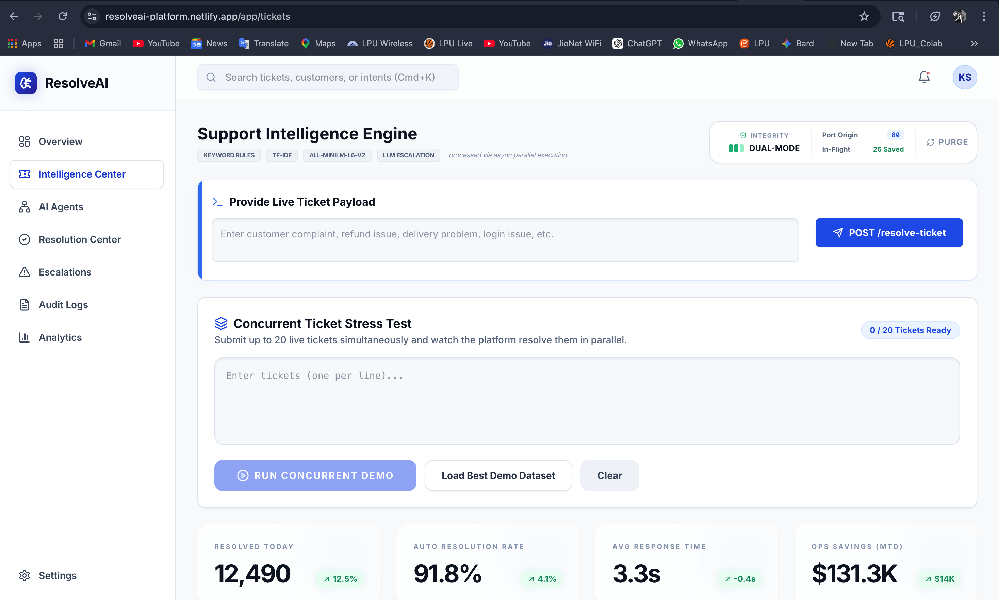

### 1️⃣2️⃣ End-to-End Workflow
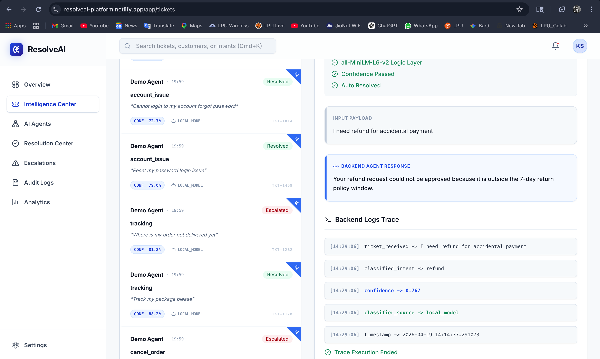


# 🧠 Intelligence Pipeline

```text
           Incoming Support Ticket
                    ↓
           Keyword Rules Engine
                    ↓
           TF-IDF Semantic Matching
                    ↓
           MiniLM Local Classifier
                    ↓
           Confidence Score Evaluation
                    ↓
┌────────────────────────────┬─────────────────────────────┐
│ Confidence Passed          │ Confidence Failed           │
│ Local Auto Resolution      │ LLM Fallback                │
└────────────────────────────┴─────────────────────────────┘
                    ↓
        Human Escalation if Needed
```

---

# ⚙️ Core Features

# 🔹 Live Ticket Intelligence Engine

- Submit real-time support tickets
- Detect customer intent instantly
- Show confidence score live
- Auto-route to correct resolution layer
- Mirror backend reasoning in UI

---

# 🔹 Hybrid AI Resolution System

## Layer 1 — Rules Engine

Fast deterministic keyword routing.

Examples:

- refund  
- login  
- cancel  
- delayed order  

---

## Layer 2 — TF-IDF Semantic Matching

Handles variations in language:

- “Need my money back”
- “Want refund”
- “Please reverse payment”

---

## Layer 3 — Local AI Classifier

Uses:

```text
all-MiniLM-L6-v2
```

For contextual sentence understanding with low latency.

---

## Layer 4 — Confidence Threshold Routing

If score > threshold:

```text
Auto Resolve Locally
```

Else:

```text
Fallback to LLM
```

---

## Layer 5 — Human Escalation

For:

- angry customers  
- complex billing disputes  
- sensitive operations  
- uncertain model decisions

---

# 📊 Executive Dashboard

Enterprise-grade command center includes:

- Tickets resolved today
- Automation success rate
- Avg response latency
- Cost savings
- Escalation volume
- Intent distribution
- Resolution trends

---

# 🤖 AI Agent Network

Visual topology of active agents:

- Intake Agent  
- Intent Router  
- Rule Engine  
- Semantic Matcher  
- Policy Evaluator  
- Execution Agent  
- Escalation Agent  
- LLM Fallback Layer  

---

# 🧾 Unified Audit Logs

Every decision is traceable.

Examples:

```text
ticket_received
classified_intent
confidence_score
classifier_source
flow_decision
timestamp
```

Ideal for:

- Compliance
- Governance
- Debugging
- Enterprise trust

---

# 🛡️ Escalation Console

Low-confidence or risky tickets are routed to human review.

Human operators can:

- Approve route
- Reject action
- Draft manual reply
- Override AI decision

---

# 🧪 Example Ticket Resolution

## Input

```text
I accidentally selected annual enterprise plan. Please refund and move us to monthly.
```

## Backend Output

```json
{
  "intent": "refund_request",
  "confidence": 0.98,
  "source": "local_model",
  "flow": "auto_resolved"
}
```

---

# 🛠️ Technology Stack

# Frontend

- React.js
- Tailwind CSS
- Framer Motion
- Responsive SaaS UI

# Backend

- FastAPI
- Python
- REST APIs
- Swagger Docs

# AI / ML

- scikit-learn
- TF-IDF Vectorizer
- cosine similarity
- sentence-transformers
- all-MiniLM-L6-v2

# Deployment

- Render
- Netlify / Vercel

---

# 📈 Business Impact

ResolveAI is valuable for:

## SaaS Platforms

Reduce repetitive support load.

## E-commerce

Refunds, cancellations, deliveries.

## Fintech

Billing issues with auditability.

## Logistics

Tracking + escalations.

## IT Helpdesks

Password resets + routing.

---

# 💰 Expected Outcomes

Typical benefits:

- ⚡ Faster first response time
- 💸 Lower support costs
- 👨‍💼 Better human utilization
- 📉 Lower ticket backlog
- 🔍 Full AI transparency

---

# 🔐 Why Hybrid AI > Pure Chatbots

| Capability | Generic Chatbot | ResolveAI |
|-----------|----------------|-----------|
| Speed | Medium | Fast |
| Cost | High | Low |
| Determinism | Low | High |
| Traceability | Low | High |
| Human Escalation | Weak | Strong |
| Enterprise Ready | Medium | High |

---

# 📂 Repository Structure

```text
ResolveAI/
├── frontend/
├── backend/
├── screenshots/
├── docs/
├── README.md
└── LICENSE
```

---

# 🚀 Local Setup

## Backend

```bash
cd backend
pip install -r requirements.txt
uvicorn main:app --reload
```

## Frontend

```bash
cd frontend
npm install
npm run dev
```

---

# 🌐 Live Links

Frontend Demo : https://resolveai-platform.netlify.app/
Backend API   : https://resolveai-backend-bv4e.onrender.com
Swagger Docs  : https://resolveai-backend-bv4e.onrender.com/docs

---

# 🧭 Future Roadmap

- CRM integrations
- Zendesk / Freshdesk plugins
- Multi-language support
- Voice ticket automation
- RAG knowledge base answers
- SLA breach prediction
- Workforce planning AI
- Role-based access control

---

# 👨‍💻 About the Builder

**Shubham Gupta**  
B.Tech CSE | AI/ML + Full Stack Engineer

Focused on building practical intelligent systems combining product design, backend engineering, and applied AI.

---

# 💼 Why Companies Like This Project

ResolveAI demonstrates real capability in:

- Product thinking
- Full-stack engineering
- Applied machine learning
- AI system orchestration
- Human-in-loop automation
- SaaS dashboard UX
- Operational scalability

---

# ⭐ Support

If you found this project valuable, consider starring the repository.

---

<div align="center">

## Built for the Future of Enterprise Operations

### ResolveAI

</div>
